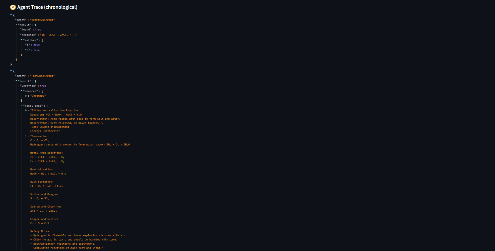
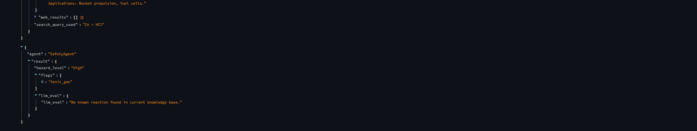
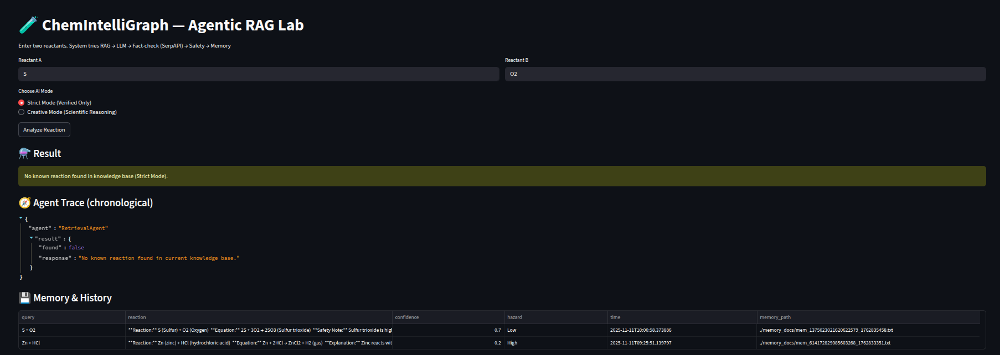
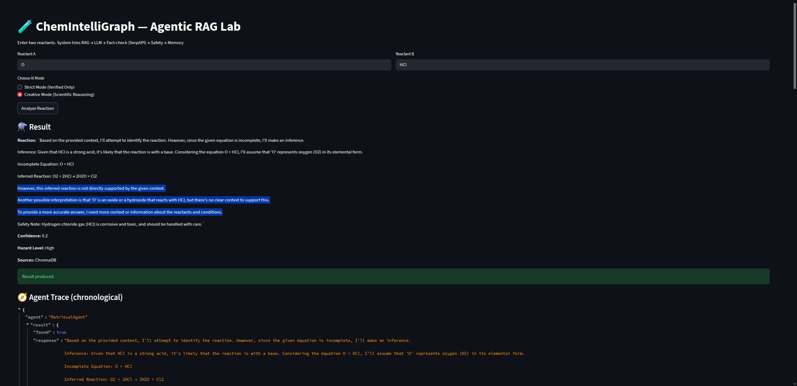
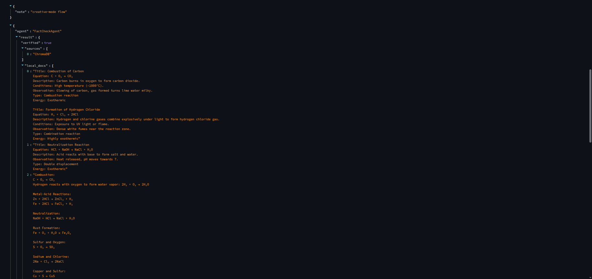
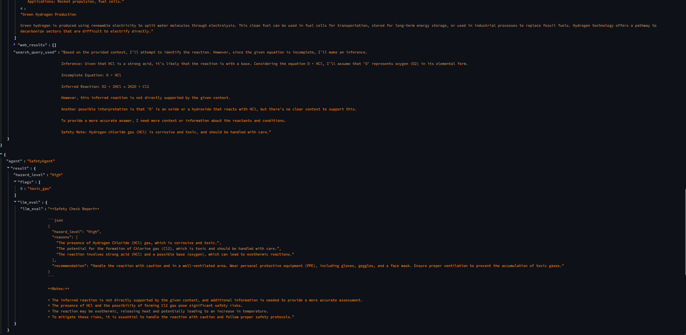

# Chemixtry Chatbot - Lab for Chemical Reactions

## 🧪 Virtual Chemistry RAG Lab: An AI-Augmented Interactive Platform for Scientific Knowledge Retrieval and Reasoning
The Chemixtry Chatbot Lab for Chemical Reactions is a RAG Lab presents an innovative approach to interactive science learning and reasoning using Retrieval-Augmented Generation (RAG).

The system integrates a Streamlit-based multimodal interface with a vectorized knowledge base of curated chemistry documents to simulate laboratory experimentation through conversational interaction.
By combining semantic retrieval, contextual prompt engineering, and generative reasoning, the model provides explainable, factual, and educationally grounded answers to queries such as
“What happens when Zinc reacts with Hydrochloric acid?”
"Explain oxidation in simple terms.”


## Table of Contents

1. [Introduction](#introduction) 
2. [Methodology](#methodology) 
3. [Knowledge Source](#knowledge-source)
4. [Text Preprocessing](#text-preprocessing)
5. [ Prompt Template Design](#prompt-template-design)
6. [ Modes of Operation](#modes-of-operation)
7. [ Setup & Usage Guide — Virtual Chemistry RAG Lab](#setup-&-usage-guide—virtual-chemistry-rag-lab)
8. [ Modes of Operation](#understanding-operational-modes)
9. [ Examples ](#example-queries-to-try)
10. [ Results and Discussion](#results-and-discussion)
11. [ Troubleshooting](#troubleshooting)
10. [ Next Steps](#next-steps)
11. [ Future Work](#future-work)
12. [ Conclusion](#conclusion)


# Introduction
Recent advances in large language models (LLMs) have enabled systems capable of generating natural, human-like responses to complex queries.
However, pure generative models often lack factual grounding, especially in scientific domains where accuracy is paramount.

To address this, Retrieval-Augmented Generation (RAG) has emerged as a hybrid architecture — combining retrieval from a knowledge base with contextual reasoning via generation.
The Virtual Chemistry RAG Lab applies this paradigm to the field of chemistry education by creating a virtual experiment environment where users can mix chemical reactants, observe AI-generated outcomes, and understand underlying scientific principles.

The project focuses on:

- Domain-specific knowledge retrieval (Chemistry)
- Transparent and explainable AI reasoning
- Multimodal user interaction for simulation and learning
- Methodology
The system consists of three key layers:

- Frontend (Streamlit Interface) – Provides an interactive, visual lab environment.
- RAG Core Engine – Combines retrieval and generation using semantic embeddings.
- Vector Database Layer – Stores and retrieves chemistry knowledge in vectorized form.


# 3.1 Data Preparation

## Knowledge Source:
The data/ directory contains curated .txt documents representing verified chemistry knowledge such as:

- reactions_knowledge.txt — common inorganic reactions
- water_formation.txt — oxidation and hydrogen combustion
- biotechnology.txt — cross-disciplinary test file
## Text Preprocessing:
Documents are cleaned, tokenized, and chunked into semantically coherent units.

# 3.2 Vectorization and Retrieval

- Each text chunk is embedded using SentenceTransformer to generate fixed-size semantic vectors.

- Vectors are stored locally using a lightweight vector store (FAISS/Chroma) for offline access.

- Queries are embedded and compared using cosine similarity, returning the most relevant context.

# 3.3 Generation and Prompt Engineering

## 🧩 Prompt Template Design
The Virtual Chemistry RAG Lab employs a structured prompt-based reasoning framework embedded within the RAGAssistant class.
This design ensures that the language model operates under controlled scientific constraints, adapting its reasoning behavior according to the selected operational mode —** Strict or Creative.**

The prompt structure consists of two key components:

- System Prompt — Defines the assistant’s personality, safety rules, and factual boundaries.

- User Template — Dynamically injects the retrieved contextual text and user query during runtime.

### 1️⃣ System Prompt (Strict Mode)
Used when the model must produce strictly factual responses derived only from the retrieved knowledge base.
You are ChemGPT, a Virtual Chemistry Lab Assistant that answers ONLY
based on the retrieved knowledge base context. This is STRICT mode.

Rules:

- NEVER hypothesize or guess missing reactions.
- NEVER reference unrelated reactions or analogies.
- If context lacks information, say exactly:
- "No known reaction found in current knowledge base."
- Refuse unsafe, illegal, or manipulative questions.
- Use concise scientific tone with markdown formatting.
Remember: You are not generating — you are retrieving factual info only.

This configuration enforces retrieval integrity — the model is constrained to operate purely within the context of verified chemistry data.
It prevents hallucination and maintains scientific trustworthiness.

#### [A] If Retrieval found in strict mode 


If any retrieval happens then it is sent to remaining 2 agents for fact checking and safety checking.
### Fact Checking Agent



### Safety Agent



#### [B] If Retrieval not found in strict mode 




### 2️⃣ System Prompt (Creative Mode)
Used when the model is allowed to perform guided reasoning or educational expansion beyond the retrieved text.
You are ChemGPT Creative Mode — a Chemistry Assistant that combines
the retrieved context with your general scientific knowledge.

Rules:

- Start from context if available.
- If missing, you MAY infer plausible scientific explanations.
- Label inferred parts clearly, e.g., "Based on known chemistry..."
- Always include safety notes and clear disclaimers.
- Keep the tone educational and accurate.
This configuration encourages exploratory reasoning while maintaining transparency — any inference is explicitly labeled, ensuring the distinction between factual and generated content.



It is now passed to other 2 agents for further factual and safety checking

### Fact Checking Agent



### Safety Agent



### 3️⃣ User Prompt Template
Both modes utilize a shared template that injects retrieved text and user query into the LLM input during inference:
Context:
{context}

User Question:
{question}
Answer:

This template ensures a consistent reasoning pipeline — the assistant always grounds its answers in retrieved context before generating a response.
User Prompt:
Reaction between Zn and HCl.
This ensures factuality, educational tone, and consistent structure across responses.

# Modes of Operation
## 4.1 Retrieval Mode (Offline)

- Uses only locally stored .txt documents.
- Works entirely offline — suitable for educational institutions.
- Ensures traceable and verifiable outputs (no hallucinations).

## 4.2 Chat Mode (Interactive Q&A)

- Leverages generative AI reasoning (LLM) for conceptual discussions.
- Offers explanatory, exploratory, and creative chemistry interactions.
- Enables contextual dialogue (“Why does heating sodium release light?”).
- Screenshot from 2025-11-04 13-26-49.png
- Screenshot from 2025-11-04 13-27-32.png

# ⚙️ Setup & Usage Guide — Virtual Chemistry RAG Lab
This guide walks you through every step to set up, configure, and run the Virtual Chemistry RAG Lab — from environment creation to API key setup and app execution.

## 🧪 1️⃣ Prerequisites
Before you begin, ensure you have the following installed:

- 🐍 Python 3.10+
- 💾 pip (Python package manager)
- 🌐 Internet connection (for model API access)
- 🧰 Git
- 🔐 API Key
  
##  🧬 2️⃣ Clone the Repository
### Clone the project
```bash
git clone 
https://github.com/Blessy456b/rag_lab.git
```
### Move into the project folder
```bash
cd rag_lab/src
```
### 🧱 3️⃣ Create and Activate a Virtual Environment
It is best practice to use an isolated virtual environment to manage project dependencies.

🐧 Linux / macOS:
```bash
python3 -m venv rag_lab_env
source rag_lab_env/bin/activate
```
### 📦 4️⃣ Install Required Dependencies
Once your virtual environment is active, install all dependencies:
```bash
pip install -r requirements.txt
```
This installs:

- Streamlit (UI framework)
- LangChain (RAG orchestration)
- SentenceTransformers (embedding model)
- Groq LLM interfaces
- dotenv (for API key management)
- 
### 🔐 5️⃣ API Key Setup
Your assistant supports GROQ model backend

Provider Model Example Environment Variable

🧠 Groq llama-3.1-8b-instant GROQ_API_KEY
🔧 Create a .env file inside /src:
```bash
nano .env
```
# Copy to .env and fill values
```bash
SERPAPI_API_KEY= "< Please fill your Serp API KEY >"
MCP_SECRET= "< Please fill MCP Key or your secret key  >"

MCP_BASE=http://127.0.0.1:8080/tool

# Optional LLM keys (only needed for creative mode)
GROQ_API_KEY="< Please fill your GROK API key >"
```
⚠️ Security Note:
Do not share .env files or commit them to GitHub.
Instead, include a .env_example file showing the required variable names without real values.

### ⚗️ 6️⃣ Run the Application
Make sure that you are in src directory ; if not run - 
```bash
cd rag_lab/src
```
### ⚙️ 3️⃣ Export MCP_SECRET before starting the backend

When you start your backend server, you’ll want this environment variable available to any process (especially the Streamlit app).

Run:
```bash
export MCP_SECRET="<YOUR_RANDOM_SECRET>"
```
This ensures the app can verify requests coming from your MCP server.

### 🚀 4️⃣ Run the MCP (FastAPI or Uvicorn) server

If your project has a FastAPI server (say in mcp_server.py):
```bash
uvicorn mcp_server:app --host 127.0.0.1 --port 8080 --reload
```

#### ✅ It will now be available at http://127.0.0.1:8080/tool — exactly what MCP_BASE expects.

### 🧠 5️⃣ Run the Streamlit UI

In another terminal (same venv):
```bash
streamlit run streamlit_app.py
```
You’ll see something like:
- ✅ VectorDB initialized: rag_documents
- ✅ Chemistry Assistant ready in _____ Mode.

#### Option 1 — Streamlit Interface (Recommended)
Launch the interactive chemistry lab UI:
```bash
streamlit run app_lab_chat.py
```
Once launched, open the local URL displayed in your terminal (e.g., 
http://localhost:8501
) to interact with the assistant.
You’ll see:
- Input Textbox for entering reactants
- Visual test tubes

#### Option 2 — CLI Testing (Without UI)
If you prefer to test the logic from terminal:
```bash
python3 rag_assistant.py
```
# 🧠 7️⃣ Understanding Operational Modes
The RAG assistant supports two reasoning modes:

Mode Behavior Use Case
- ⚖️ Strict Mode Answers only from retrieved knowledge base Verified scientific facts
- 🎨 Creative Mode Combines retrieved context + LLM reasoning Educational explanations, inferences

To change mode:

assistant = RAGAssistant(mode="creative")
or
toggle in GUI

# 🚀 9️⃣ Example Queries to Try
Once running, try:
- “What happens when zinc reacts with hydrochloric acid?”
- “Explain oxidation .”
The assistant retrieves factual data from your /data folder and generates an explainable, contextual response.

# 🧩 1️⃣0️⃣ Troubleshooting
Issue Possible Cause Solution
- No API key found - .env missing or wrong variable name = Verify key name matches table above
- ImportError: sentence_transformers - Dependencies not installed = Run pip install -r requirements.txt
- Streamlit not found - Virtual env not activated = Activate environment again
- Slow responses- Free-tier model rate limits Try smaller queries or switch model provider

# 🧾 1️⃣1️⃣ Next Steps
🧠 Add small new .txt files to the data/ folder for more reactions.

Implementation Details
Component Technology Stack
UI Framework Streamlit
- Embedding Model SentenceTransformers (MiniLM / all-MiniLM-L6-v2)
- Vector Database FAISS / Chroma
- Programming Language Python 3.12
- Libraries LangChain, numpy, pandas, dotenv
- Deployment Localhost / Ready Tensor compatible

# Results and Discussion
The system successfully demonstrated:

- High factual consistency due to retrieval grounding.
- Interactive learning engagement in virtual chemistry experiments.
- Explainability and transparency through human-readable .txt knowledge bases.
- Preliminary evaluations with domain-specific test queries show that retrieved responses align closely with verified chemical reactions, minimizing hallucinations compared to pure LLM-based generation.

# Future Work
- 🧬 Multilingual RAG Expansion – Support Indian languages for wider access.
- ⚙️ Dynamic Knowledge Ingestion – Allow uploading of new documents.
- 🎨 Reaction Visualization – Add chemical equation animations and molecular imagery.
- 🧠 Cross-domain Integration – Extend to physics and biology experiments.
- 🔒 Secure Collaboration – Incorporate user experiment history and authentication.

# Conclusion
The Virtual Chemistry RAG Lab showcases the potential of combining retrieval-augmented architectures with interactive learning interfaces for scientific domains.
By grounding AI reasoning in transparent, verifiable text sources, the system enhances both trust and educational value in AI-driven science tools.
This framework can be extended across multiple domains to promote explainable, domain-specific AI reasoning for academic and research applications.

# References
- Reimers, N. & Gurevych, I. Sentence-BERT: Sentence Embeddings using Siamese BERT-Networks. EMNLP 2019.
- Langraph Documentation
- LangChain Documentation. Building RAG Pipelines. 2024.
- Streamlit Inc. Streamlit for Interactive Data Apps.

# Acknowledgements
Developed by Blessy Thomas
Built with curiosity using Streamlit, LangChain, and Vector Search technologies for Ready Tensor certification.

# Contact
For queries
- github : 
https://github.com/Blessy456b

- gmail : 
blessy456bthomas@gmail.com


